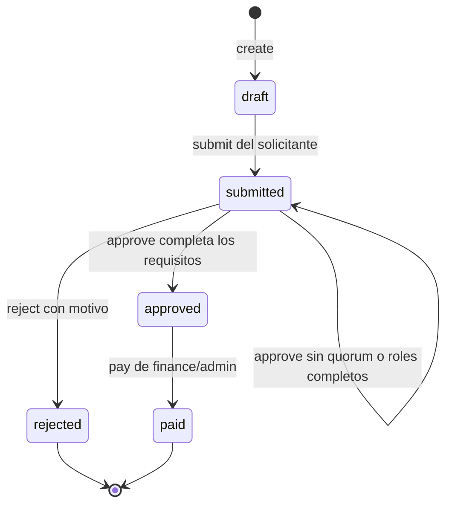

# Solicitudes de gasto y aprobaciones

`src/business/approvals` contiene un dominio ejecutable de gastos por proyecto.
El pago registra un recibo **simulado en memoria**: no realiza transferencias ni
contacta con un proveedor financiero. Este repositorio es independiente del
PostgreSQL de proyectos; se pierde al reiniciar y no se comparte entre procesos.

## Reglas de negocio

Un miembro o administrador crea un borrador con título, proyecto, importe y
moneda. El solicitante queda fijado por el actor autenticado. El dominio valida
sus entradas incluso si se invoca directamente, sin DTO ni controlador Nest.

- `amountMinor` es un `number` entero positivo seguro: céntimos para EUR/USD.
  Se rechazan decimales, cero, negativos, `NaN`, infinito y números mayores que
  `Number.MAX_SAFE_INTEGER`. `50001` representa 500,01 EUR o USD.
- La moneda es exactamente `EUR` o `USD`. No hay conversión de divisas; la
  política de ejemplo aplica los mismos umbrales numéricos a ambas monedas.
- El título tiene de 3 a 160 caracteres después de quitar espacios exteriores;
  el proyecto y los identificadores deben ser textos no vacíos.
- Solo el solicitante puede presentar su borrador. Aprobadores, finanzas y
  administradores pueden revisar; nunca pueden aprobar ni rechazar una solicitud
  propia, aunque tengan varios roles.
- Cada persona puede aprobar una sola vez. Los roles de esa aprobación quedan
  registrados en el momento de emitirla. Los requisitos se fijan al presentar
  el borrador y aparecen en el snapshot y la auditoría.

| Importe en unidades mínimas | Personas distintas | Roles requeridos dentro del grupo                       |
| --------------------------- | ------------------ | ------------------------------------------------------- |
| 1 a 50 000                  | 1                  | `approver`, `finance` o `admin`                         |
| 50 001 a 500 000            | 2                  | Al menos una persona `finance` o `admin`                |
| Más de 500 000              | 3                  | Al menos una persona `finance` o `admin`, y una `admin` |

Un administrador satisface el requisito financiero, pero sus varios roles no
cuentan como varias personas. Alcanzar el número de aprobaciones sin los roles
necesarios conserva el estado `submitted`. Se pueden incorporar más revisores
hasta satisfacer todos los requisitos.



`rejected` y `paid` son terminales. El rechazo exige un motivo de 3 a 500
caracteres. Solo `finance` o `admin` pueden registrar el pago de una solicitud
aprobada. Un solicitante con ese rol puede registrar el pago después de que otras
personas hayan aprobado su solicitud; la prohibición de autorrevisión sigue
vigente.

## Contrato de aplicación

El controlador Nest usa `ExpenseWorkflow`; una factoría de providers conecta el
repositorio y la política. El dominio no importa Nest ni depende de HTTP.

```ts
import {
  ExpenseWorkflow,
  InMemoryExpenseRepository,
  ThresholdApprovalPolicy,
} from './src/business/approvals/index.js';

const workflow = new ExpenseWorkflow(
  new InMemoryExpenseRepository(),
  new ThresholdApprovalPolicy(),
);
const requester = { id: 'member-1', roles: ['member'] };
const result = await workflow.create(
  {
    projectId: 'project-1',
    title: 'Créditos del servidor de build',
    amountMinor: 25000,
    currency: 'EUR',
  },
  requester,
);
if (result.ok) {
  await workflow.submit(
    result.value.id,
    { expectedVersion: result.value.version },
    requester,
  );
} else {
  console.log(result.error.code, result.error.message);
}
```

| Método                      | Entradas además de `id`                         | Resultado                         |
| --------------------------- | ----------------------------------------------- | --------------------------------- |
| `create(input, actor)`      | `projectId`, `title`, `amountMinor`, `currency` | Borrador, versión 1               |
| `get(id)`                   | Ninguna                                         | Snapshot actual                   |
| `submit(id, input, actor)`  | `expectedVersion`                               | Presentada                        |
| `approve(id, input, actor)` | `expectedVersion`                               | Presentada o aprobada             |
| `reject(id, input, actor)`  | `expectedVersion`, `reason`                     | Rechazada                         |
| `pay(id, input, actor)`     | `expectedVersion`, `idempotencyKey`             | Pagada o recibo del mismo comando |

Todos devuelven `Promise<ExpenseResult<ExpenseSnapshot>>`: la unión discriminada
es `{ ok: true, value }` o `{ ok: false, error: { code, message } }`. Los códigos
son `INVALID_INPUT`, `NOT_FOUND`, `INVALID_TRANSITION`, `FORBIDDEN`,
`DUPLICATE_APPROVAL`, `VERSION_CONFLICT` e `IDEMPOTENCY_CONFLICT`. Los errores de
programación o del repositorio se propagan; no se convierten en éxitos vacíos.

El snapshot contiene identificadores, estado, versión, requisitos, aprobaciones,
eventos, rechazo y recibo. Es JSON seguro: números enteros, cadenas ISO para fechas,
arrays, objetos y `null`; no expone campos privados, `Date`, `Map` ni `BigInt`.
La integración HTTP valida que el proyecto exista y controla el acceso al gasto.
El dominio conserva `projectId`, sin acceder por sí mismo a Workspaces o JWT.

## Concurrencia e idempotencia

Cada cambio confirmado incrementa la versión en uno y añade un evento de auditoría
tipado. Las operaciones rechazadas no cambian el agregado. El repositorio compara
`expectedVersion` y escribe sin ningún `await` entre ambas acciones. Si dos
aprobaciones leen la misma versión, solo una se guarda; la otra recibe
`VERSION_CONFLICT` y puede reintentarse después de leer el nuevo estado.

La clave de pago tiene entre 8 y 128 caracteres: letras, números, `.`, `_`, `:` y
`-`, empezando por una letra o un número. Se asocia a **id del gasto, id del pagador
y expectedVersion original**. Repetir exactamente ese comando devuelve el mismo
recibo, incluso si otro intento ya incrementó la versión. También se comprueba el
caso donde el primer intento confirma el pago entre la consulta de clave y la
lectura de versión de otro intento.

- La escritura del pago y el registro de idempotencia forman una sola operación
  en este proceso. Los reintentos simultáneos no duplican recibos ni eventos.
- Reutilizar la clave con otro gasto, pagador o versión produce
  `IDEMPOTENCY_CONFLICT`. El namespace de claves abarca este repositorio completo.
- Los permisos del pagador se comprueban también en los reintentos. Un actor que
  haya perdido el rol financiero no puede recuperar el recibo mediante `pay`.
- Dos claves distintas sobre la misma versión compiten; solo una se confirma.
  La clave perdedora no se reserva. Un gasto ya pagado no admite otro pago.

Esta atomicidad es local al proceso de Node. Una implementación persistente
necesitaría una transacción y restricciones de unicidad para garantizar el mismo
contrato. No hay locks distribuidos, gateway de pagos ni garantía de conservación
después de un reinicio.

## Variedad TypeScript y pruebas

| Caso                                                            | Implementación                                                 |
| --------------------------------------------------------------- | -------------------------------------------------------------- |
| Encapsulación real con `#private`, getters y snapshots aislados | `ExpenseMoney`, `ExpenseRequest`, `VersionedAggregate`         |
| Clases abstractas, herencia y `override`                        | `ApprovalPolicy` / `ThresholdApprovalPolicy`, agregado base    |
| Interfaces estructurales, `readonly` y `satisfies`              | Actores, inputs, repositorio, records y pruebas                |
| Sobrecargas                                                     | `ExpenseMoney.of(input)` y `.of(amountMinor, currency)`        |
| Typestate, genéricos y parámetro `this`                         | `ExpenseRequest<'draft'>` solo puede presentar un borrador     |
| Mapped types y uniones discriminadas                            | Agregados por estado, payloads de eventos y `ExpenseResult<T>` |
| Narrowing sin casts de estado                                   | Workflow y transiciones tras inspeccionar `expense.state`      |
| Contratos positivos y errores de compilación esperados          | `expense.type-test.ts` con `@ts-expect-error`                  |

```sh
pnpm exec vitest run src/business/approvals/expense.workflow.spec.ts
pnpm typecheck
pnpm exec oxlint --type-aware src/business/approvals
```

Las 24 pruebas ejercitan importes y límites, roles, quórum, autorrevisión,
inmutabilidad, rechazo, transiciones prohibidas, conflictos simultáneos y pagos
idempotentes. Las fixtures `*.type-test.ts` se verifican mediante TypeScript;
Vitest no las ejecuta y la aplicación no las importa. Una llamada ilegal sigue
rechazándose en runtime aunque un consumidor omita el chequeo estático.
